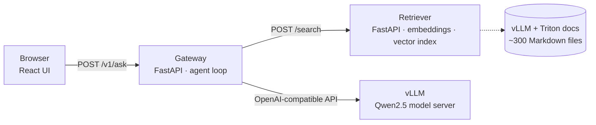

# Cloud AI Documentation Assistant

A question-answering assistant for **vLLM** and **NVIDIA Triton Inference Server** documentation. It retrieves the relevant docs, answers with an open-source LLM served by **vLLM**, checks that the answer is actually supported by the sources, and cites them.

It runs as three containerized microservices with Docker Compose (tested), and includes Kubernetes deployment manifests (schema-validated; live cluster validation is pending). Everything in this repo is free to run: a laptop for development, and a free Kaggle or Colab GPU for benchmarks.



| Service | What it does | Tech |
|---|---|---|
| **gateway** | Public API and UI. Runs the answer strategy, tracks timings and token usage. | Python, FastAPI, httpx, React |
| **retriever** | Splits docs into heading-aware chunks and serves **hybrid search**: embeddings + BM25 keyword scoring, merged with reciprocal rank fusion. | FastEmbed (BAAI/bge-small-en-v1.5, ONNX), NumPy |
| **vllm** | Serves the LLM with continuous batching and PagedAttention. Structured outputs force valid JSON for the agent. | vLLM (CPU image locally, GPU image in the cloud) |

## How an answer is produced

Two modes, selectable per request, so their quality and latency can be compared:

- **`rag`**: retrieve once, then answer once. One LLM call.
- **`agent`** (default):
  1. The model chooses to **search**, and writes its own query.
  2. It drafts an **answer** citing sources like `[S1]`.
  3. An **evidence check**, a separate LLM call in a fresh context, decides whether every claim is supported by the retrieved excerpts.
  4. If not, the gateway searches for the missing piece and the model revises its answer, up to `MAX_AGENT_STEPS`.

The model's step choices are constrained to a JSON schema through vLLM's structured outputs, so a small model can't break the loop with malformed output. If it does, the code falls back safely.

Every response includes the steps taken, the sources, LLM calls, tokens and a timing breakdown (LLM vs retrieval). The UI shows all of them.

## Results

**Retrieval accuracy:** 20 documentation questions, 4,722 chunks from 301 files, `bench/eval_retrieval.py`. These are measured.

| Search mode | hit@1 | hit@4 | avg search |
|---|---|---|---|
| Dense (embeddings only) | 60% | 90% | 98 ms |
| Keyword (BM25 only) | 75% | 90% | 96 ms |
| **Hybrid (dense + BM25, RRF)** | **80%** | **95%** | 93 ms |

Hybrid search fixed the questions that hinge on exact terms like `config.pbtxt` or `gpu-memory-utilization`, which embeddings alone ranked too low. With 20 questions, each one is 5 points, so add more to `bench/questions.jsonl` for a tighter estimate.

**End to end, CPU only:** vLLM 0.29 CPU backend, Qwen2.5-0.5B, 2 vCPUs. This is a smoke test, not a performance claim.

| Measurement | `rag` mode | `agent` mode |
|---|---|---|
| Latency p50 / p95 | 17.2 s / 19.4 s | 27.9 s / 38.6 s |
| LLM calls per answer | 1.0 | 3.4 |
| Share of time in the LLM | 98.5% | 98.2% |

Almost all the latency is model inference; retrieval is under 0.6 s. That's the case for GPU serving. vLLM on those 2 vCPUs produced about 10–16 output tokens/s, with 0 errors across all runs.

**On an NVIDIA GPU:** GPU benchmarking is planned and not yet measured. `notebooks/free_gpu_benchmark.ipynb` runs it on a free Kaggle T4, and its results will be added here.

**Quality checks:** 88 tests (`pytest`), including malformed model output (`[1]`, `true`, wrong field types, unreadable verdicts) at the unit and HTTP level, pyflakes clean, both Docker images build and the full `docker compose` stack runs (3 containers healthy, service-name networking, retriever starts in under 1 s from the prebuilt index), both Kubernetes configurations pass `kubeconform -strict` (10/10 resources each), and the UI was tested in headless Chrome on desktop and mobile widths with no console errors.

---

## Run it on Windows (free)

You need Windows 10/11 with **WSL2** and **Docker Desktop**, which is free for personal use, education and small businesses. A machine with 16 GB RAM is comfortable; 8 GB works if you close other apps.

### 1. One-time setup

In **PowerShell (as Administrator)**:

```powershell
wsl --install -d Ubuntu
```

Restart, then open **Ubuntu** from the Start menu and create your Linux user.

Give WSL enough memory. Create `C:\Users\<your-Windows-username>\.wslconfig` containing:

```ini
[wsl2]
memory=10GB
processors=4
```

Then run `wsl --shutdown` in PowerShell.

Install **Docker Desktop** and turn on *Settings → Resources → WSL integration → Ubuntu*.

In the **Ubuntu** terminal, install kubectl and minikube:

```bash
curl -LO "https://dl.k8s.io/release/$(curl -Ls https://dl.k8s.io/release/stable.txt)/bin/linux/amd64/kubectl"
sudo install kubectl /usr/local/bin/ && rm kubectl
curl -LO https://storage.googleapis.com/minikube/releases/latest/minikube-linux-amd64
sudo install minikube-linux-amd64 /usr/local/bin/minikube && rm minikube-linux-amd64
```

Check your CPU. vLLM's CPU backend runs best with AVX-512, and works with AVX2:

```bash
lscpu | grep -o -w 'avx512f\|avx2' | sort -u
```

### 2. Get the code and the docs corpus

```bash
git clone https://github.com/Rushikareddy23/docs-rag-inference.git && cd docs-rag-inference
bash scripts/fetch_docs.sh       # downloads vLLM + Triton docs (~300 Markdown files)
```

### 3a. Fastest: Docker Compose

```bash
docker compose up --build
```

The first start downloads the model (about 1 GB) and embeds the docs. When vLLM logs `Application startup complete`, open **http://localhost:8080**.

### 3b. Kubernetes with minikube

```bash
minikube start --cpus 4 --memory 9000 --driver docker
eval $(minikube docker-env)                     # build images straight into minikube
docker build -t docs-rag/retriever:dev services/retriever
docker build -t docs-rag/gateway:dev services/gateway
kubectl apply -k k8s/base
kubectl -n docs-rag get pods -w                 # wait until all are Running and READY
kubectl -n docs-rag port-forward svc/gateway 8080:8080
```

Open **http://localhost:8080**. Some useful commands:

```bash
kubectl -n docs-rag logs deploy/vllm -f         # watch the model load
kubectl -n docs-rag get hpa                     # gateway autoscaler
kubectl -n docs-rag describe pod -l app=vllm    # probe or memory problems
kubectl delete -k k8s/base                      # tear everything down
```

`k8s/overlays/gpu` is the same deployment for a cluster with NVIDIA GPUs and the NVIDIA device plugin. It swaps in the GPU vLLM image, a 7B model and an `nvidia.com/gpu: 1` request: `kubectl apply -k k8s/overlays/gpu`.

## Benchmarks

**On a free GPU:** open `notebooks/free_gpu_benchmark.ipynb` in Kaggle (*File → Import notebook*), set *Accelerator → GPU T4* and *Internet → On*, then *Run All*. It installs vLLM, benchmarks it, builds the index, runs the retrieval eval and the end-to-end comparison, and prints a summary to paste into **Results**.

**On your laptop**, with the stack running and vLLM port-forwarded:

```bash
kubectl -n docs-rag port-forward svc/vllm 8000:8000 &
kubectl -n docs-rag port-forward svc/retriever 8001:8001 &
python bench/bench_llm.py --concurrency 1 4 8 --requests 16 --label "laptop CPU" --out results/llm_cpu.json
python bench/eval_retrieval.py --url http://localhost:8001
cd bench && python bench_gateway.py --url http://localhost:8080 --n 10
```

| Script | Measures |
|---|---|
| `bench/bench_llm.py` | TTFT and end-to-end p50/p95 with streaming, output tokens/s, at each concurrency level |
| `bench/eval_retrieval.py` | hit@k for dense, BM25 and hybrid search (`--mode dense bm25 hybrid`) on `bench/questions.jsonl` |
| `bench/bench_gateway.py` | `rag` vs `agent`: latency, LLM calls per answer, time in LLM vs retrieval |

## Develop and test

```bash
python -m venv .venv && source .venv/bin/activate
pip install -r requirements-dev.txt
pytest -q                                          # 88 tests, no model or GPU needed

# run the services without Docker, against a fake LLM
uvicorn tests.fake_llm:app --port 8000 &
(cd services/retriever && EMBEDDER=hash uvicorn retriever.main:app --port 8001 &)
(cd services/gateway && uvicorn gateway.main:app --port 8080 &)
cd services/gateway/web && npm install && npm run dev   # UI with hot reload on :5173
```

## Troubleshooting

| Symptom | Cause | Fix |
|---|---|---|
| vLLM pod restarts, or the log says `Worker proc ... died unexpectedly (exit code: -9)` | Out of memory. The **first request** also triggers a C++ compile that briefly needs extra RAM. | Give WSL/minikube more memory (`.wslconfig`, `minikube start --memory`). If `lscpu` shows `avx512f`, switch `--dtype=float32` to `--dtype=bfloat16` in `k8s/base/vllm.yaml`, which halves model memory. You can also lower `VLLM_CPU_KVCACHE_SPACE` to `1`. |
| Gateway returns `502 upstream error: ConnectError` | vLLM or the retriever isn't up yet | `kubectl -n docs-rag get pods`, then wait for vLLM's startup probe. The UI shows this error message instead of breaking. |
| Answers are slow on a laptop (10–30 s) | CPU inference: about 10–16 tokens/s on 2 vCPUs | Expected. Use `mode: "rag"` (1 LLM call) for demos, or run the Kaggle notebook to see GPU speed. |
| Answers have few `[S#]` citations | Very small models ignore citation instructions | The gateway attributes each sentence to its best-matching source automatically. Sentences with no clear source stay uncited on purpose. A 1.5B+ model cites better. |
| Retriever image build is slow | Embedding about 4.7k chunks on CPU | It happens once, at `docker build`, and is skipped on rebuilds unless the docs changed (fingerprint check; `python -m retriever.build_index --force` to redo it). Pods then start in seconds. |
| The first few answers after starting vLLM take 1–2 minutes | vLLM compiles its CPU kernels on the first requests (one-time warm-up) | Send one test question after startup. Measured here: about 110 s cold, then about 1.5 s for a short reply. |

## Design decisions (and why)

- **vLLM behind an OpenAI-compatible API.** The gateway only speaks the OpenAI chat protocol, so the model server can be swapped (Triton's OpenAI frontend, a bigger model, a GPU node) with a config change.
- **Continuous batching is why throughput scales.** vLLM adds new requests to the running batch at every decoding step, and PagedAttention stores the KV cache in pages so many sequences fit in memory. `bench_llm.py` shows this as throughput rising with concurrency while per-request speed drops slightly.
- **Structured outputs for the agent, plus defensive parsing.** A 0.5–1.5B model often writes almost-JSON. Constraining decoding to a schema makes the loop reliable. The parser also accepts only a JSON *object* with correctly typed fields, so replies like `[1]`, `true` or `{"query": 5}` fall back to a safe default instead of crashing (covered by tests).
- **Post-hoc citation attribution.** Each sentence without a citation gets the `[S#]` of the retrieved source whose terms it overlaps most, at 50% overlap or more. It's deterministic and costs no LLM call. Unsupported sentences stay visibly uncited instead of getting a made-up citation.
- **Evidence check in a fresh context.** The verifier sees only the sources and the draft, not the agent's earlier reasoning, so it judges support rather than agreeing with itself. The check has three outcomes: supported, unsupported (search for what is missing, then revise), or **unverified** when the verdict isn't a real JSON boolean. Unverified is never reported as success, and it doesn't trigger another search, so a flaky checker can't loop. The step budget caps cost.
- **Heading-aware chunking with overlap.** Each chunk starts with its section title, so a passage like "set it to 0.9" keeps its context. Overlap stops facts from being split across a boundary.
- **Hybrid retrieval.** Embeddings capture meaning ("run copies of a model" finds `instance_group`), but blur exact identifiers. BM25 nails identifiers but misses paraphrases. Reciprocal Rank Fusion merges the two rankings without calibrating their very different scores. It measured +20 points hit@1 over dense alone.
- **NumPy instead of a vector database.** About 5k chunks × 384 dimensions is about 7 MB, and a search is one matrix-vector product taking about 1 ms. A vector DB adds operations work without adding speed at this size. `index.py` is the only file that would change.
- **Index built at image build time.** Embedding the corpus takes minutes on a CPU. Doing it in `docker build` makes pods start in seconds and run without internet. A fingerprint of the docs skips re-embedding when nothing changed. Small embedding batches keep memory around 430 MB instead of 3.5 GB.
- **Kubernetes details.** A startup probe gives vLLM time to download and load the model without being killed. Gateway readiness depends on both upstreams, so no traffic arrives before they're up. The HPA scales only the stateless gateway; the model server scales by adding GPUs. Containers run as non-root.

## Project layout

```
services/
  gateway/    FastAPI API + agent loop (gateway/), React UI (web/), multi-stage Dockerfile
  retriever/  chunking, embeddings, vector index, prebuilt-index Dockerfile
k8s/          base manifests (CPU) + overlays/gpu
bench/        load test, retrieval eval, end-to-end comparison, question set
notebooks/    free Kaggle/Colab GPU benchmark
tests/        unit tests + a fake OpenAI-compatible server
scripts/      fetch_docs.sh
```

The documentation corpus is downloaded from the [vLLM](https://github.com/vllm-project/vllm) (Apache-2.0) and [Triton Inference Server](https://github.com/triton-inference-server/server) (BSD-3-Clause) repositories and is not committed here.
